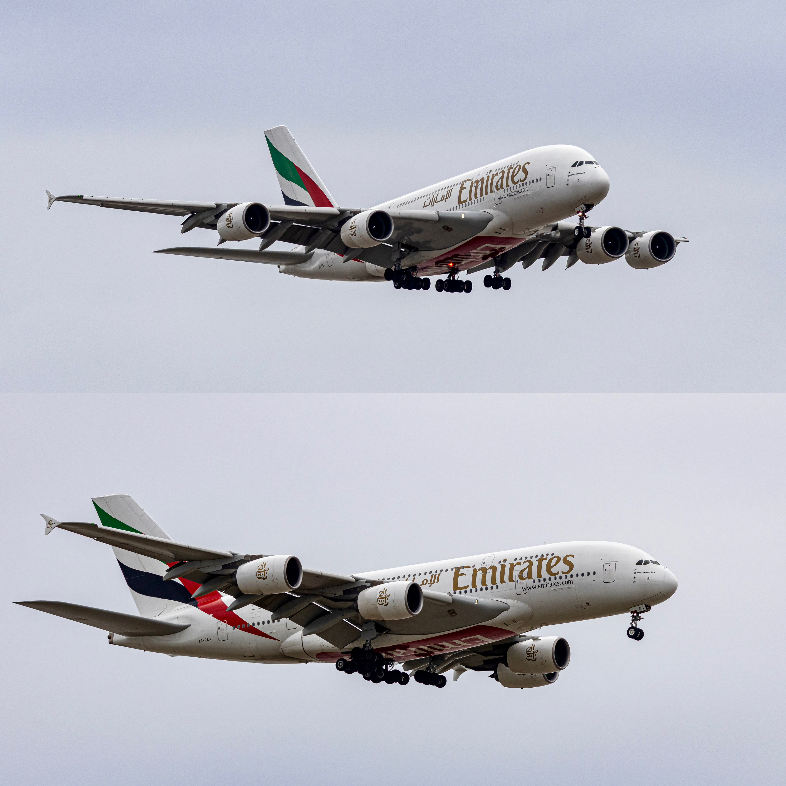
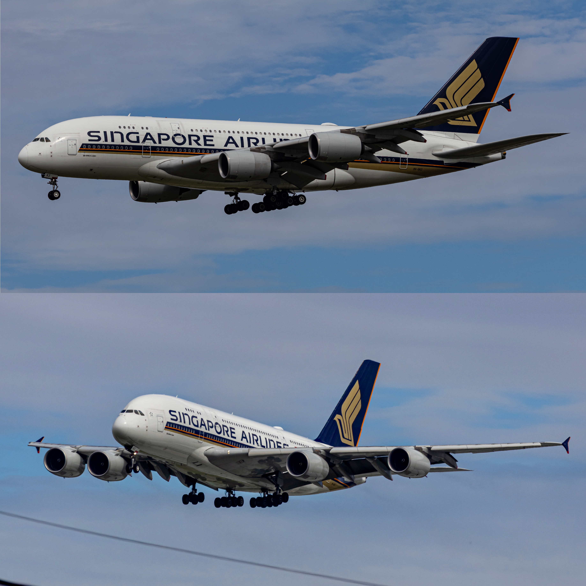
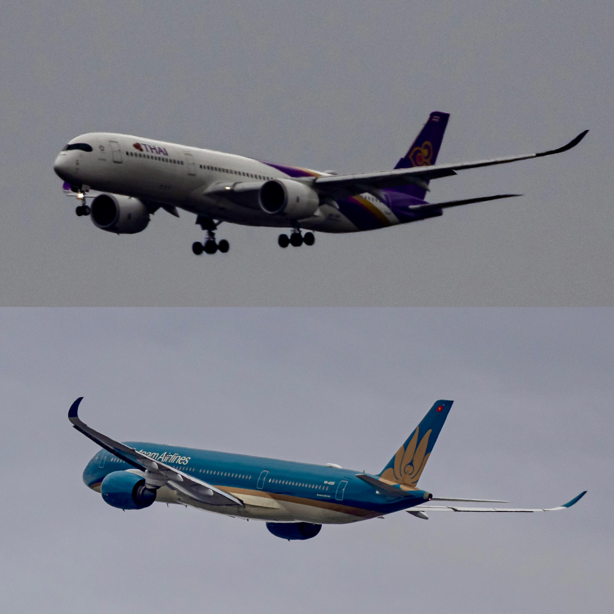
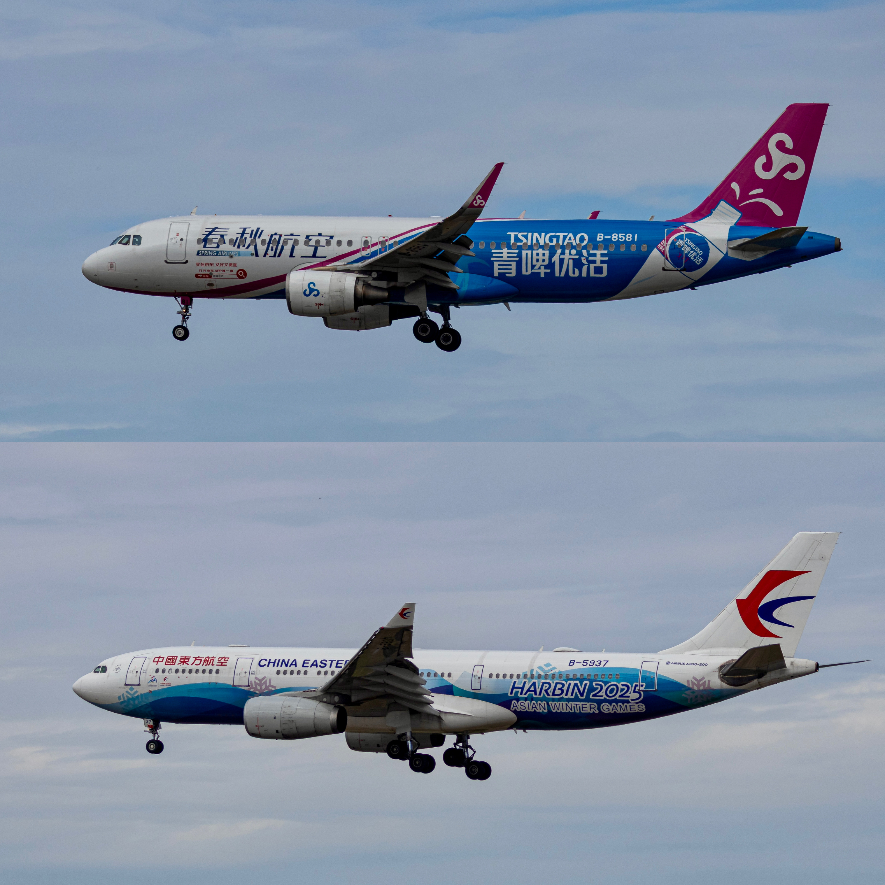
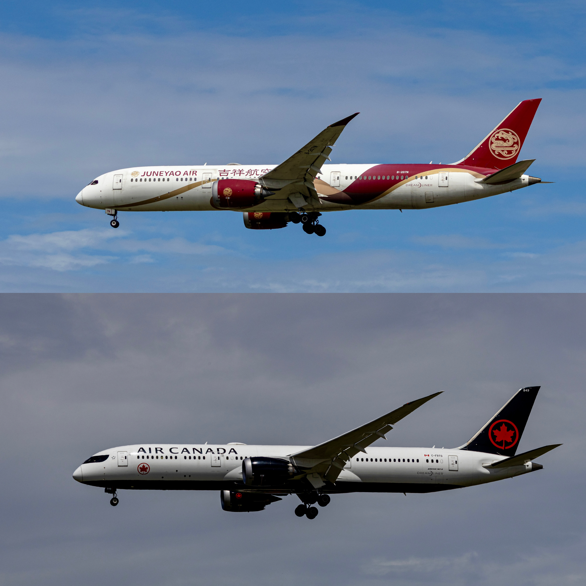
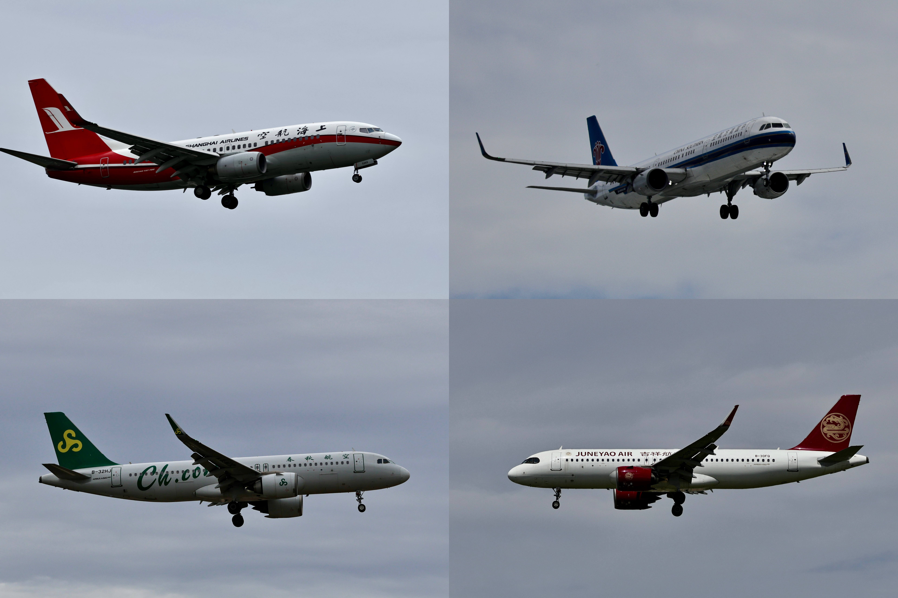
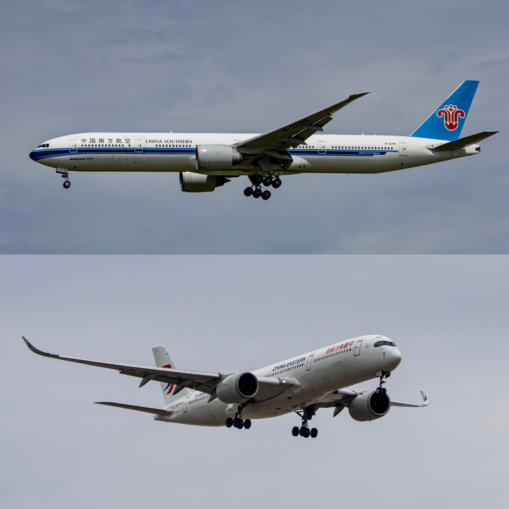
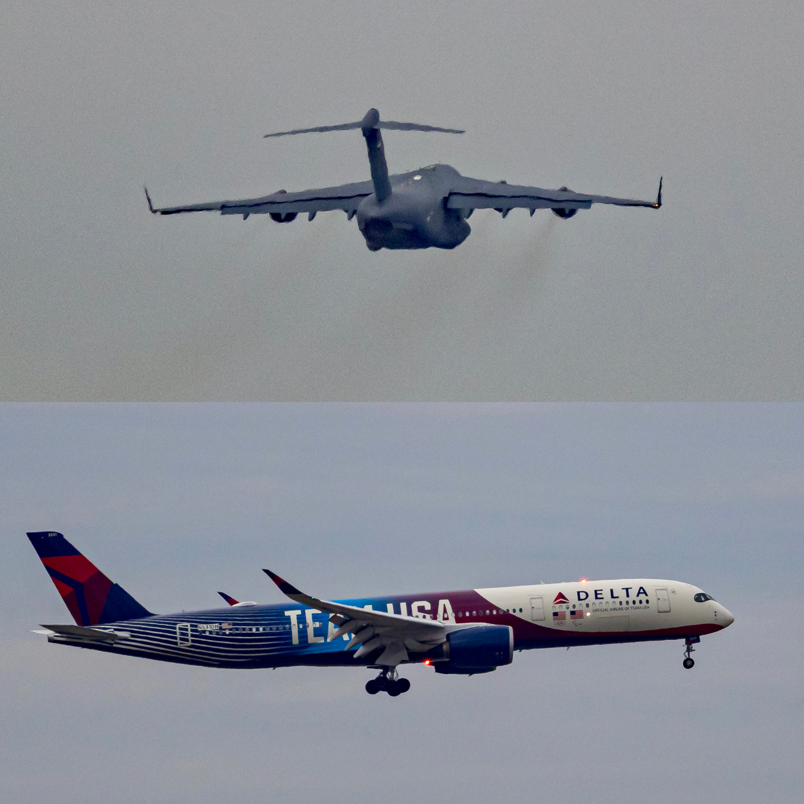
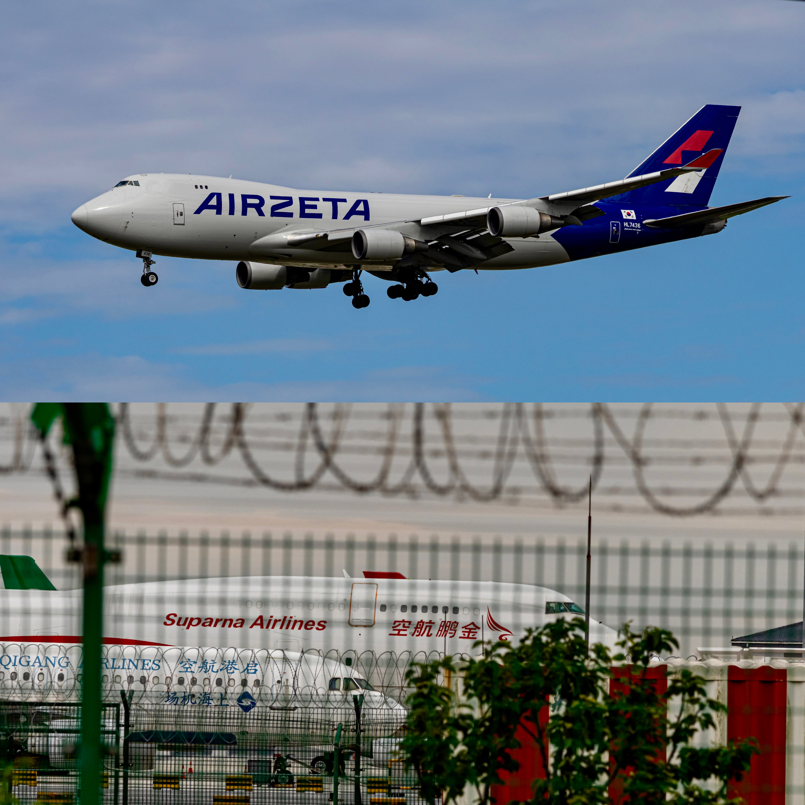
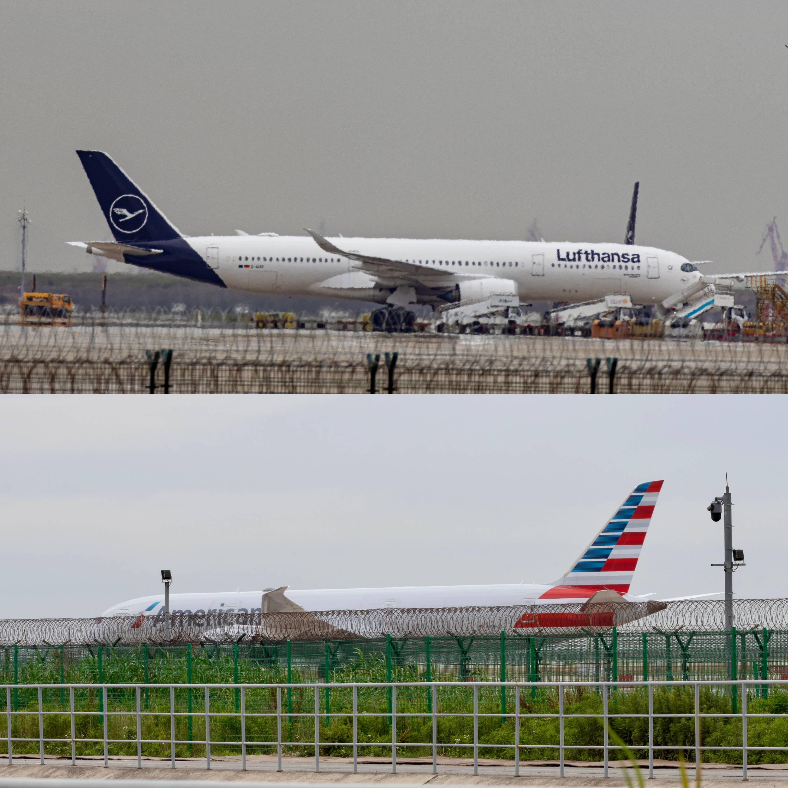

2026 年 5 月 31 日，在上海浦东国际机场拍摄的一组航机照片。

这一天记录到了 A380、A350、B787、B777、B747 等多种机型，也包括多架特殊涂装和彩绘机。

> 日期：2026-05-31  
> 地点：上海浦东国际机场（PVG / ZSPD）  
> 主题：Aircraft Spotting / 飞机摄影

## 01｜Emirates · Airbus A380

阿联酋航空 A380，两张不同角度的进近照片。

## 02｜Singapore Airlines · Airbus A380

新加坡航空 A380，包含侧面与前侧进近角度。

## 03｜Thai Airways / Vietnam Airlines

泰国国际航空 A350 与越南航空宽体客机。

## 04｜Spring Airlines / China Eastern Airlines

春秋航空「青啤优活」彩绘机，以及中国东方航空「哈尔滨 2025 亚洲冬季运动会」主题彩绘机。

## 05｜Juneyao Air / Air Canada

吉祥航空 Boeing 787 Dreamliner 与加拿大航空 Boeing 787 Dreamliner。

## 06｜Shanghai Airlines / China Southern / Spring Airlines / Juneyao Air

四架窄体客机的进近记录：

- 上海航空
- 中国南方航空
- 春秋航空
- 吉祥航空

## 07｜China Southern · Boeing 777 / China Eastern · Airbus A350

中国南方航空 Boeing 777 与中国东方航空 Airbus A350。

## 08｜Military Transport / Delta Air Lines

上图为大型军用运输机远距离记录；下图为达美航空特殊涂装 Airbus A350。

## 09｜AirZeta Cargo · Boeing 747 / Suparna Airlines

AirZeta 货运 Boeing 747，以及隔着机场围界拍摄的金鹏航空飞机。

## 10｜Lufthansa / American Airlines

汉莎航空 Airbus A350 与美国航空宽体客机的地面记录。

---

**Shanghai Pudong International Airport · 2026.05.31**
